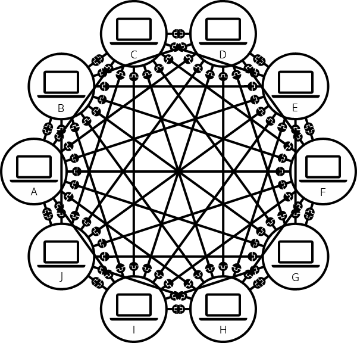
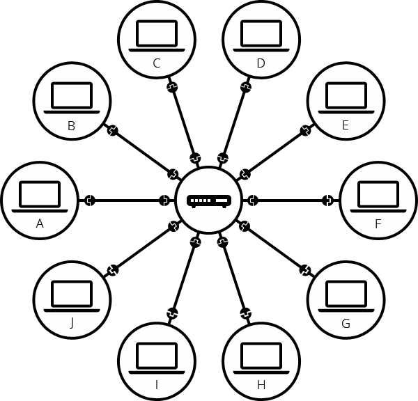
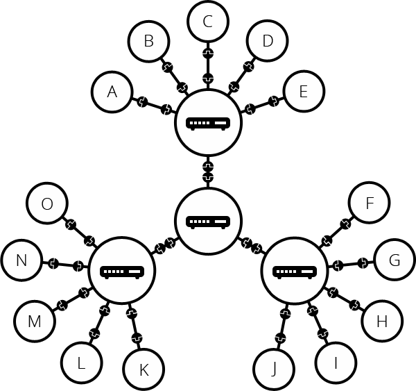
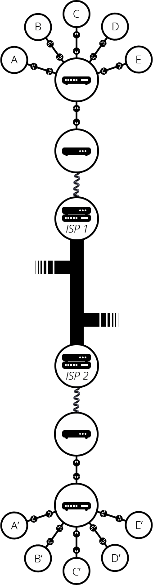
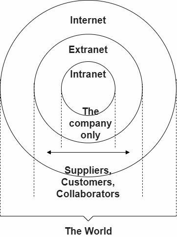
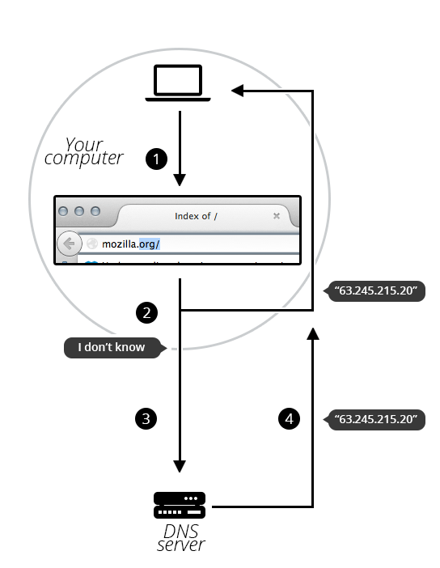
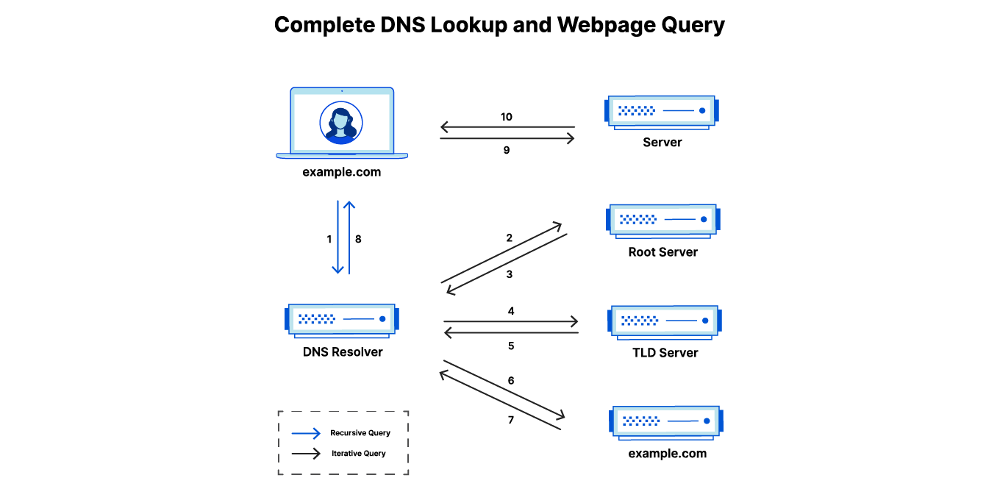

**Table of Contents**

* [What is The Internet](#what-is-the-internet)
* [How does the Internet work](#how-does-the-internet-work)
* * [A network of networks](#a-network-of-networks)
* * [Domain names](#domain-names)
* * [Internet and the Web](#internet-and-the-web)
* * [Intranets and Extranets](#intranets-and-extranets)
* [What is HTTP](#what-is-http)
* * [What is an HTTP request](#what-is-an-http-request)
* * [What is an HTTP method](#what-is-an-http-method)
* * [What are HTTP headers](#what-are-http-headers)
* * [What is an HTTP request body](#what-is-and-http-request-body)
* * [What is an HTTP response](#what-is-and-http-response)
* * [What's an HTTP status code](#whats-an-http-status-code)
* * [What is in an HTTP response body](#what-is-in-an-http-response-body)
* * [Can DDoS attacks be launched over HTTP](#can-ddos-attacks-be-launched-over-http)
* [What is a Domain name](#what-is-a-domain-name)
* * [Structure of domain names](#structure-of-domain-names)
* * [Who owns a domain name](#who-owns-a-domain-name)
* * [Finding an available domain name](#finding-an-available-domain-name)
* * [DNS refreshing](#dns-refreshing)
* * [How does a DNS request work](#how-does-a-dns-request-work)
* [What is DNS](#what-is-dns)
* * [How does DNS work](#how-does-dns-work)
* * [There are 4 DNS servers involved in loading a webpage](#there-are-4-dns-servers-involved-in-loading-a-webpage)
* * [What are the steps in a DNS lookup](#what-are-the-steps-in-a-dns-lookup)
* * [What is DNS caching](#what-is-dns-caching-where-does-dns-caching-occur)
* * * [Browser DNS caching](#browser-dns-caching)
* * * [OS level DNS caching](#operating-system-os-level-dns-caching)


---


# What is The Internet?

[<sub>Source</sub>](https://en.wikipedia.org/wiki/Internet)

The Internet (or internet) is the global system of interconnected computer networks that uses the Internet protocol suite (TCP/IP) to communicate between networks and devices. It is a network of networks that comprises private, public, academic, business, and government networks of local to global scope, linked by electronic, wireless, and optical networking technologies. The Internet carries a vast range of information services and resources, such as the interlinked hypertext documents and applications of the World Wide Web (WWW), electronic mail, discussion groups, internet telephony, streaming media and file sharing.

Most traditional communication media, including telephone, radio, television, paper mail, newspapers, and print publishing, have been transformed by the Internet, giving rise to new media such as email, online music, digital newspapers, news aggregators, and audio and video streaming websites. The Internet has enabled and accelerated new forms of personal interaction through instant messaging, Internet forums, and social networking services. Online shopping has also grown to occupy a significant market across industries, enabling firms to extend brick and mortar presences to serve larger markets. Business-to-business and financial services on the Internet affect supply chains across entire industries. 

The Internet has no single centralized governance in either technological implementation or policies for access and usage. Each constituent network sets its own policies. The overarching definitions of the two principal name spaces on the Internet, the Internet Protocol address (IP address) space and the Domain Name System (DNS), are directed by a maintainer organization, the Internet Corporation for Assigned Names and Numbers (ICANN). The technical underpinning and standardization of the core protocols is an activity of the non-profit Internet Engineering Task Force (IETF).

# How does the Internet work?

[<sub>Source</sub>](https://developer.mozilla.org/en-US/docs/Learn_web_development/Howto/Web_mechanics/How_does_the_Internet_work)

The Internet is the backbone of the Web, the technical infrastructure that makes the Web possible. At its most basic, the Internet is a large network of computers which communicate all together.

When two computers need to communicate, you have to link them, either physically (usually with an Ethernet cable) or wirelessly (for example with Wi-Fi or Bluetooth systems). All modern computers can sustain any of those connections.

Such a network is not limited to two computers. You can connect as many computers as you wish. But it gets complicated quickly. If you're trying to connect, say, ten computers, you need 45 cables, with nine plugs per computer!



To solve this problem, each computer on a network is connected to a special tiny computer called a network switch (or switch for short). This switch has only one job: like a signaler at a railway station, it forwards messages toward their intended recipients. To send a message to computer B, computer A sends the message to the switch, which in turn forwards the message to computer B.

Once we add a switch to the system, our network of 10 computers only requires 10 cables: a single plug for each computer and a switch with 10 plugs.



To tell computers apart, the switch uses MAC addresses, which identify network interfaces for delivery within the local network. MAC addresses are like fingerprints; they are typically assigned by the manufacturer, but software can also assign or change them (common today for privacy reasons). Each message carries the sender's and recipient's MAC addresses. The switch reads the sender's address and remembers which connection the message arrived from, so it knows where to forward future messages addressed to that sender. If it hasn't yet learned where a recipient is, it forwards the message through all its other connections. When the recipient sends a message back, the switch learns its location too.

## A network of networks

So far so good. But what about connecting hundreds, thousands, billions of computers? Of course a single switch can't scale that far, but, if you read carefully, we said that a switch is a computer like any other, so what keeps us from connecting two switches together? Nothing, so let's do that.



Connecting switches this way extends a single local network. Each switch has an extensive map of which connection to use for each MAC address in its local network. If you connected ten billion computers in this network, each switch would need to remember up to ten billion MAC addresses. Whenever the recipient's address is unknown (or it has been deleted due to inactivity), switches must broadcast the message to all computers on the local network. As the network grows, it becomes increasingly costly to keep track of individual devices and find unknown recipients.

The key problem is that our addresses have no hierarchy and don't correspond to the network structure—it's like trying to figure out who to deliver mail to by comparing each person's fingerprint. To fix this problem, we divide computers into separate local networks and connect these networks using a device called a **router**. It uses a different kind of address, an IP address, which is a 4-number sequence like `142.250.190.78`. Unlike MAC addresses, which are "fingerprints", IP addresses are "street addresses" and are assigned when a computer connects to a network, identified in the IP address by a shared prefix. A **router** can therefore store forwarding instructions for a whole group of addresses (e.g., "forward to this **router** whenever the IP address starts with `142.250`") without learning the location of every individual computer in tha

Such a network comes very close to what we call the Internet. We just need the physical medium (cables) to connect all these routers. Luckily, such an infrastructure already existed prior to the Internet, and that's the telephone network. To connect our network to the telephone infrastructure, we need a special piece of equipment called a **modem**. This **modem** turns the information from our network into information manageable by the telephone infrastructure and vice versa.

> Note that the commercial router in your home is likely a combination of a **switch**, a **router**, and a **modem**, all in one device.

So we are connected to the telephone infrastructure. The next step is to send the messages from our network to the network we want to reach. To do that, we will connect our network to an **Internet Service Provider (ISP)**. An **ISP** is a company that manages some special routers that are all linked together and can also access other ISPs' routers. So the message from our network is carried through the network of **ISP** networks to the destination network. The Internet consists of this whole infrastructure of networks.



## Domain names

IP addresses are perfectly fine for computers, but we human beings have a hard time remembering that sort of address. To make things easier, we can alias an IP address with a human-readable name called a **domain name**. For example (at the time of writing; IP addresses can change) `google.com` is the **domain name** used on top of the IP address `142.250.190.78`. So using the **domain name** is the easiest way for us to reach a computer over the Internet.

## Internet and the web

As you might notice, when we browse the Web with a Web browser, we usually use the domain name to reach a website. Does that mean the Internet and the Web are the same thing? It's not that simple. As we saw, **the Internet is a technical infrastructure which allows billions of computers to be connected all together.** Among those computers, some computers (called Web servers) can send messages intelligible to web browsers. **The Internet is an infrastructure, whereas the Web is a service built on top of the infrastructure.** It is worth noting there are several other services built on top of the Internet, such as email and IRC.

## Intranets and Extranets

**Intranets** are private networks that are restricted to members of a particular organization. They are commonly used to provide a portal for members to securely access shared resources, collaborate and communicate. For example, an organization's intranet might host web pages for sharing department or team information, shared drives for managing key documents and files, portals for performing business administration tasks, and collaboration tools like wikis, discussion boards, and messaging systems.

**Extranets** are very similar to Intranets, except they open all or part of a private network to allow sharing and collaboration with other organizations. They are typically used to safely and securely share information with clients and stakeholders who work closely with a business. Often their functions are similar to those provided by an intranet: information and file sharing, collaboration tools, discussion boards, etc.

>Both **intranets** and **extranets** run on the same kind of infrastructure as the Internet, and use the same protocols. They can therefore be accessed by authorized members from different physical locations.



# What is HTTP?

[<sub>Source</sub>](https://www.cloudflare.com/en-gb/learning/ddos/glossary/hypertext-transfer-protocol-http/)

The Hypertext Transfer Protocol (HTTP) is the foundation of the World Wide Web, and is used to load webpages using hypertext links. HTTP is an application layer protocol designed to transfer information between networked devices and runs on top of other layers of the network protocol stack. A typical flow over HTTP involves a client machine making a request to a server, which then sends a response message.

## What is in an HTTP request?

An HTTP request is the way Internet communications platforms such as web browsers ask for the information they need to load a website.

Each HTTP request made across the Internet carries with it a series of encoded data that carries different types of information. A typical HTTP request contains:

**1.** HTTP version type
**2.** a URL
**3.** an HTTP method
**4.** HTTP request headers
**5.** Optional HTTP body

## What is an HTTP method?

An HTTP method, sometimes referred to as an HTTP verb, indicates the action that the HTTP request expects from the queried server. For example, two of the most common HTTP methods are `‘GET’` and `‘POST’`; a `‘GET’` request expects information back in return (usually in the form of a website), while a `‘POST’` request typically indicates that the client is submitting information to the web server (such as form information, e.g. a submitted username and password).

## What are HTTP headers?

HTTP headers contain text information stored in key-value pairs, and they are included in every HTTP request/response. These headers communicate core information, such as what browser the client is using and what data is being requested/fetched.

## What is in an HTTP request body?

The body of a request is the part that contains the `‘body’` of information the request is transferring. The body of an HTTP request contains any information being submitted to the web server, such as a username and password, or any other data entered into a form.

## What is in an HTTP response?

An HTTP response is what web clients (often browsers) receive from an Internet server in answer to an HTTP request. These responses communicate valuable information based on what was asked for in the HTTP request.

A typical HTTP response contains:

**1.** an HTTP status code
**2.** HTTP response headers
**3.** optional HTTP body

## What’s an HTTP status code?

HTTP status codes are 3-digit codes most often used to indicate whether an HTTP request has been successfully completed. Status codes are broken into the following 5 blocks:

**1.** 1xx Informational
**2.** 2xx Success
**3.** 3xx Redirection
**4.** 4xx Client Error
**5.** 5xx Server Error

The `“xx”` refers to different numbers between `00` and `99`.

## What is in an HTTP response body?

Successful HTTP responses to `‘GET’` requests generally have a body which contains the requested information. In most web requests, this is HTML data that a web browser will translate into a webpage.

## Can DDoS attacks be launched over HTTP?

Keep in mind that HTTP is a `“stateless”` protocol, which means that each command runs independent of any other command. In the original spec, HTTP requests each created and closed a TCP connection. In newer versions of the HTTP protocol (HTTP 1.1 and above), persistent connection allows for multiple HTTP requests to pass over a persistent TCP connection, improving resource consumption. In the context of DoS or DDoS attacks, HTTP requests in large quantities can be used to mount an attack on a target device, and are considered part of application layer attacks or layer 7 attacks.

# What is a Domain Name?

[<sub>Source</sub>](https://developer.mozilla.org/en-US/docs/Learn_web_development/Howto/Web_mechanics/What_is_a_domain_name)

**Domain names** are a key part of the Internet infrastructure. They provide a human-readable address for any web server available on the Internet.

Any Internet-connected computer can be reached through a public IP Address, either an IPv4 address (e.g., `192.0.2.172`) or an IPv6 address (e.g., `2001:db8:8b73:0000:0000:8a2e:0370:1337`).

Computers can handle such addresses easily, but people have a hard time finding out who is running the server or what service the website offers. IP addresses are hard to remember and might change over time.

## Structure of domain names

A domain name has a simple structure made of several parts (it might be one part only, two, three…), separated by dots and **read from right to left:**


- **TLD (Top-Level Domain)**

  - TLDs tell users the general purpose of the service behind the domain name. The most generic TLDs (`.com`, `.org`, `.net`) don't require web services to meet any particular criteria, but some TLDs enforce stricter policies so it is clearer what their purpose is. For example:

    - Local TLDs such as `.us`, `.fr`, or `.se` can require the service to be provided in a given language or hosted in a certain country — they are supposed to indicate a resource in a particular language or country.
    - TLDs containing `.gov` are only allowed to be used by government departments.
    - The `.edu` TLD is only for use by educational and academic institutions.

  - TLDs can contain special as well as latin characters. A TLD's maximum length is `63` characters, although most are around `2–3`.

- **Label (or component)**

  - The labels are what follow the TLD. A label is a case-insensitive character sequence anywhere from one to sixty-three characters in length, containing only the letters `A` through `Z`, digits `0` through `9`, and the `'-'` character (which may not be the first or last character in the label).

## Who owns a domain name?

You cannot "buy a domain name". This is so that unused domain names eventually become available to be used again by someone else. If every domain name was bought, the web would quickly fill up with unused domain names that were locked and couldn't be used by anyone.

Instead, you pay for the right to use a domain name for one or more years. You can renew your right, and your renewal has priority over other people's applications. But you never own the domain name.

Companies called registrars use domain name registries to keep track of technical and administrative information connecting you to your domain name.

> **Note:** For some domain name, it might not be a registrar which is in charge of keeping track. For instance, every domain name under `.fire` is managed by Amazon.

## Finding an available domain name

To find out whether a given domain name is available:

- Go to a domain name registrar's website. Most of them provide a "whois" service that tells you whether a domain name is available.

- Alternatively, if you use a system with a built-in shell, type a `whois` command into it, as shown here for `smartfarmaqua.ir`:

```bash
whois mozilla.org
```

```
refer:        whois.nic.ir

domain:       IR

organisation: Institute for Research in Fundamental Sciences
address:      Shahid Bahonar (Niavaran) Square
address:      Tehran 1954851167
address:      Iran (Islamic Republic of)

contact:      administrative
name:         Director
organisation: Institute for Research in Fundamental Sciences (IPM)
address:      Shahid Bahonar (Niavaran) Square
address:      Tehran 1954851167
address:      Iran (Islamic Republic of)
phone:        +98 21 22828081
fax-no:       +98 21 22295700
e-mail:       admin@irnic.ir

contact:      technical
name:         CTO
organisation: Institute for Research in Fundamental Sciences (IPM)
address:      Shahid Bahonar (Niavaran) Square
address:      Tehran 1954851167
address:      Iran (Islamic Republic of)
phone:        +98 21 22828080
fax-no:       +98 21 22295700
e-mail:       cto@irnic.ir

nserver:      A.NIC.IR 193.189.123.2 2001:678:b0:0:193:189:123:2
nserver:      B.NIC.IR 193.189.122.83 2001:678:b1:0:193:189:122:83
nserver:      C.NIC.IR 2a0c:6600:4:0:0:0:0:152 45.93.171.206
nserver:      D.NIC.IR 194.225.70.83 2001:14e8:c:0:194:225:70:83
ds-rdata:     47300 13 2 7ab287956a55abd60dc8697c2049738fd5eeab6f2070152b015d59929521dada
ds-rdata:     47300 13 4 fe3a9bfd3aed31cbd1e2f6b45c88d81b5cca68cdc9d46080c1c4afbd491ae3a9f6dfbfc4320111144c375d648ae3cdf6

whois:        whois.nic.ir

status:       ACTIVE
remarks:      Registration information: http://www.nic.ir

created:      1994-04-06
changed:      2026-05-14
source:       IANA
```

## DNS refreshing

DNS databases are stored on every DNS server worldwide, and all these servers refer to a few special servers called "authoritative name servers" or "top-level DNS servers" — these are like the boss servers that manage the system.

Whenever your registrar creates or updates any information for a given domain, the information must be refreshed in every DNS database. Each DNS server that knows about a given domain stores the information for some time before it is automatically invalidated and then refreshed (the DNS server queries an authoritative server and fetches the updated information from it). Thus, it takes some time for DNS servers that know about this domain name to get the up-to-date information.

## How does a DNS request work?

As we already saw, when you want to display a webpage in your browser it's easier to type a domain name than an IP address. Let's take a look at the process:

1. Type mozilla.org in your browser's location bar.
2. Your browser asks your computer if it already recognizes the IP address identified by this domain name (using a local DNS cache). If it does, the name is translated to the IP address and the browser negotiates contents with the web server. End of story.
3. If your computer does not know which IP is behind the mozilla.org name, it goes on to ask a DNS server, whose job is precisely to tell your computer which IP address matches each registered domain name.
4. Now that the computer knows the requested IP address, your browser can negotiate contents with the web server.



# What is DNS?

[<sub>Source</sub>](https://www.cloudflare.com/en-gb/learning/dns/what-is-dns/)

The Domain Name System (DNS) is the phonebook of the Internet. Humans access information online through domain names, like nytimes.com or espn.com. Web browsers interact through Internet Protocol (IP) addresses. DNS translates domain names to IP addresses so browsers can load Internet resources.

Each device connected to the Internet has a unique IP address which other machines use to find the device. DNS servers eliminate the need for humans to memorize IP addresses such as `192.168.1.1` (in IPv4), or more complex newer alphanumeric IP addresses such as `2400:cb00:2048:1::c629:d7a2` (in IPv6).

## How does DNS work?

The process of DNS resolution involves converting a hostname (such as `www.example.com`) into a computer-friendly IP address (such as `192.168.1.1`). An IP address is given to each device on the Internet, and that address is necessary to find the appropriate Internet device - like a street address is used to find a particular home. When a user wants to load a webpage, a translation must occur between what a user types into their web browser (`example.com`) and the machine-friendly address necessary to locate the `example.com` webpage.

In order to understand the process behind the DNS resolution, it’s important to learn about the different hardware components a DNS query must pass between. For the web browser, the DNS lookup occurs "behind the scenes" and requires no interaction from the user’s computer apart from the initial request.

## There are 4 DNS servers involved in loading a webpage:

- **DNS recursor** - The recursor can be thought of as a librarian who is asked to go find a particular book somewhere in a library. The DNS recursor is a server designed to receive queries from client machines through applications such as web browsers. Typically the recursor is then responsible for making additional requests in order to satisfy the client’s DNS query.

- **Root nameserver** - The root server is the first step in translating (resolving) human readable host names into IP addresses. It can be thought of like an index in a library that points to different racks of books - typically it serves as a reference to other more specific locations.

- **TLD nameserver** - The top level domain server (TLD) can be thought of as a specific rack of books in a library. This nameserver is the next step in the search for a specific IP address, and it hosts the last portion of a hostname (In example.com, the TLD server is “com”).

- **Authoritative nameserver** - This final nameserver can be thought of as a dictionary on a rack of books, in which a specific name can be translated into its definition. The authoritative nameserver is the last stop in the nameserver query. If the authoritative name server has access to the requested record, it will return the IP address for the requested hostname back to the DNS Recursor (the librarian) that made the initial request.

## What are the steps in a DNS lookup?

For most situations, DNS is concerned with a domain name being translated into the appropriate IP address. To learn how this process works, it helps to follow the path of a DNS lookup as it travels from a web browser, through the DNS lookup process, and back again. Let's take a look at the steps.

> Note: Often DNS lookup information will be cached either locally inside the querying computer or remotely in the DNS infrastructure. There are typically 8 steps in a DNS lookup. When DNS information is cached, steps are skipped from the DNS lookup process which makes it quicker. The example below outlines all 8 steps when nothing is cached.

**The 8 steps in a DNS lookup:**

1. A user types ‘example.com’ into a web browser and the query travels into the Internet and is received by a DNS recursive resolver.
2. The resolver then queries a DNS root nameserver (.).
3. The root server then responds to the resolver with the address of a Top Level Domain (TLD) DNS server (such as .com or .net), which stores the information for its domains. When searching for `example.com`, our request is pointed toward the .com TLD.
4. The resolver then makes a request to the .com TLD.
5. The TLD server then responds with the IP address of the domain’s nameserver, `example.com`.
6. Lastly, the recursive resolver sends a query to the domain’s nameserver.
7. The IP address for `example.com` is then returned to the resolver from the nameserver.
8. The DNS resolver then responds to the web browser with the IP address of the domain requested initially.

Once the 8 steps of the DNS lookup have returned the IP address for `example.com`, the browser is able to make the request for the web page:

9. The browser makes a HTTP request to the IP address.
10. The server at that IP returns the webpage to be rendered in the browser (step 10).



## What is DNS caching? Where does DNS caching occur? 

The purpose of caching is to temporarily stored data in a location that results in improvements in performance and reliability for data requests. DNS caching involves storing data closer to the requesting client so that the DNS query can be resolved earlier and additional queries further down the DNS lookup chain can be avoided, thereby improving load times and reducing bandwidth/CPU consumption. DNS data can be cached in a variety of locations, each of which will store DNS records for a set amount of time determined by a time-to-live (TTL).

### Browser DNS caching

Modern web browsers are designed by default to cache DNS records for a set amount of time. The purpose here is obvious; the closer the DNS caching occurs to the web browser, the fewer processing steps must be taken in order to check the cache and make the correct requests to an IP address. When a request is made for a DNS record, the browser cache is the first location checked for the requested record.

### Operating system (OS) level DNS caching

The operating system level DNS resolver is the second and last local stop before a DNS query leaves your machine. The process inside your operating system that is designed to handle this query is commonly called a “stub resolver” or DNS client. When a stub resolver gets a request from an application, it first checks its own cache to see if it has the record. If it does not, it then sends a DNS query (with a recursive flag set), outside the local network to a DNS recursive resolver inside the Internet service provider (ISP).

When the recursive resolver inside the ISP receives a DNS query, like all previous steps, it will also check to see if the requested host-to-IP-address translation is already stored inside its local persistence layer.