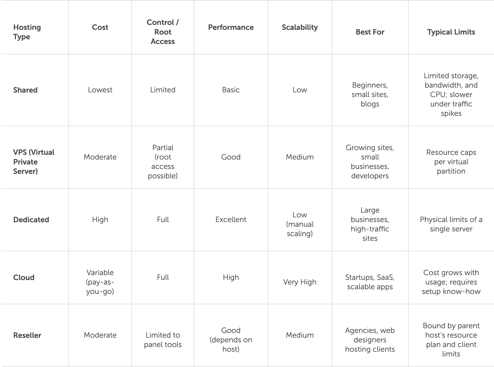

**Table of Contents**

* [What is Web Hosting](#what-is-web-hosting)
* [What type of web hosting are there](#what-type-of-web-hosting-are-there)
* * [Shared web hosting](#shared-web-hosting)
* * [VPS hosting](#vps-hosting)
* * [Dedicated hosting](#dedicated-hosting)
* * [Cloud hosting](#cloud-hosting)
* * [Reseller hosting](#reseller-hosting)

---

# What is Web Hosting?

[Source](https://www.namecheap.com/guru-guides/what-is-web-hosting/)

Web hosting is a service that allows you to rent a space on a server to store your website, so it’s available to the world. All websites need to be hosted on a server to be viewable online.

When you purchase a web hosting subscription, your website is allocated space on a server. The way that you use resources, as well as things like security and performance, will depend heavily on what kind of web hosting you choose. But here’s a quick step-by-step into how web hosting works in practice:

1. You choose and register your website’s name and connect your domain to your hosting provider's server.
Your domain name connects to your website via DNS, which translates the domain into an IP address that browsers can locate.
2. You can either upload existing website files to the server, or use a CMS to manage your website content. From here you can edit and publish your website.
3. When a visitor enters your domain name into a browser, the hosting server delivers the requested files.
4. The browser then renders your website’s files so that visitors can see your live website.

What are server resources and why do they matter?

- **CPU** handles processing tasks; more power means faster page generation.
- **RAM** manages active data; more memory means smoother performance.
- **Storage** determines how much content you can host and how quickly it’s retrieved.
- **Bandwidth** controls how much data can be transferred; higher limits mean better uptime under traffic spikes.

# What type of web hosting are there?

Web hosting comes in several different forms, each designed for different levels of performance, control, and scalability. Whether you’re building a simple blog or running a high-traffic business site, understanding the main hosting types helps you choose the plan that fits your needs and budget. Below is a breakdown of the most common hosting options.

## Shared web hosting

Shared hosting means multiple websites share the same server and its resources (like CPU, RAM, and bandwidth). It’s the most affordable and beginner-friendly option, ideal for small or low-traffic sites that don’t require advanced configuration.

- Low-cost and easy to set up
- No server management required
- Hosting provider handles maintenance and security
- Limited resources and slower performance during peak traffic
- Minimal control or customization
- Not ideal for scaling or heavy workloads
- Best for personal websites, blogs, and small business sites

## VPS hosting

With VPS hosting, you get a dedicated slice of server resources within a shared physical machine, offering more control and performance than shared hosting without the cost of a full dedicated server.

- Isolated resources ensure consistent performance and reliability
- Root access allows deeper configuration and software control
- Improved speed and stability compared to shared environments
- Requires some technical know-how to manage and secure
- Best for growing websites or businesses needing more flexibility

## Dedicated hosting

Dedicated hosting gives you an entire physical server exclusively for your website or applications, offering maximum control, performance, and reliability.

- Full access to all server resources, no sharing with others
- Maximum performance and configuration flexibility
- Highest cost compared to other hosting types
- Requires strong technical or system administration skills
- Best for high-traffic sites, enterprise workloads, or compliance-sensitive projects

## Cloud hosting

Cloud hosting uses a network of connected servers to distribute resources and handle demand dynamically, ensuring strong uptime and flexible scaling.

- Distributed infrastructure improves reliability and redundancy
- Elastic scaling handles variable or unpredictable traffic
- Excellent performance for modern web apps and growing businesses
- May cost more as usage increases
- Can require more setup or technical management than shared plans

## Reseller hosting

Reseller hosting lets you buy server resources in bulk and sell hosting plans under your own brand, using management tools to handle multiple clients efficiently.

- Create and sell hosting plans to clients
- Includes WHM or control panel access for easy management
- Custom branding and pricing for your own packages
- Profit margin depends on how you structure and sell plans