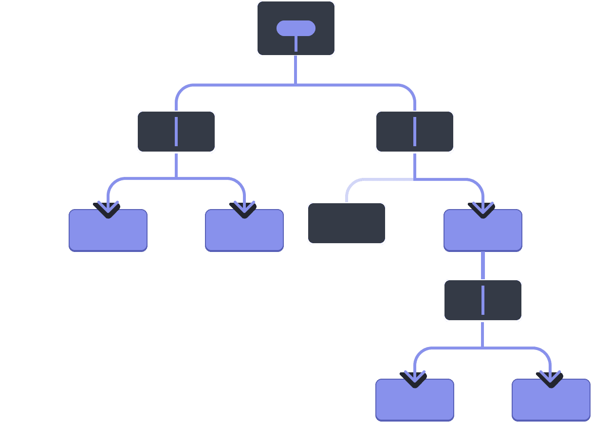

**Table of Contents**
- [Hooks](#hooks--hooks)
- [`useState`](#hooks--usestate)
- [`useRef`](#hooks--useref)
- [`useEffect`](#hooks--useeffect)
- [`useMemo`](#hooks--usememo)
- [`useCallback`](#hooks--usecallback)
- [`useReducer`](#hooks--usereducer)
- [`useContext`](#hooks--usecontext)
- [Writing Custom Hooks](#hooks--writing-custom-hooks)


---

<a name="hooks--hooks" id="hooks--hooks"></a>

# Hooks

Hooks were introduced in **React 16.8** and they let us use React's features, like managing your component's state and or performing an after effect when certain changes occur in state(s) without writing a class.

Hooks **can only** be called at the **top level of our components** or in our **custom hooks**. We **can't** call it inside **loops or conditions**.

Everything related to hooks must be [pure](https://react.dev/learn/keeping-components-pure).

Read more about hooks [here...](https://react.dev/reference/rules/rules-of-hooks)

<a name="hooks--usestate" id="hooks--usestate"></a>

## `useState`

**State: A Component's Memory**

Components often need to change what’s on the screen as a result of an interaction. Typing into the form should update the input field, clicking “next” on an image carousel should change which image is displayed, clicking “buy” should put a product in the shopping cart. Components need to “remember” things: the current input value, the current image, the shopping cart. In React, this kind of component-specific memory is called state.

### State is isolated and private

State is local to a component instance on the screen. In other words, if you **render the same component twice**, each copy will have **completely isolated state!** Changing one of them will not affect the other.

`useState` is a React Hook that lets you add a state variable to your component.

```jsx
const [state, setState] = useState(initialState)
```

### Parameters

- `initialState`: The value you want the state to be initially. It can be a value of any type, but there is a special behavior for functions. This argument is ignored after the initial render. 

- - If you pass a **function** as `initialState`, it will be treated as an *initializer function*. **It should be pure**, should **take no arguments**, and should return a value of any type. React will call your initializer function when initializing the component, and store its return value as the initial state.

### Returns

The `useState` hook returns an array with exactly 2 values:

1. **The current state.** During the first render, it will match the `initialState` you have passed.

2. **The `set` function** that lets you update the state to a different value and trigger a re-render.

The convention is to name state variables like `[something, setSomething]` using array destructuring.

**The set function** returned by useState lets you update the state to a different value and **trigger a re-render**. You can pass the next state directly, or a function that calculates it from the previous state:

```ts
const [count, setCount] = useState(0);

const handleClick = () => {
  setCount(1);
}

const anotherHandleClick = (by: number) => {
  setCount(c => c + by)
  // `c`: the current value of state.
  // changes made to `c` will be our updated state.
}
```

### Caveats

- The `set` function **only updates the state variable for the *next* render.** If you read the state variable after calling the `set` function, you will still get the old value that was on the screen before your call.

- If the new value you provide is identical to the current `state`, as determined by an `Object.is` comparison, **React will skip re-rendering the component and its children.** This is an optimization. Although in some cases React may still need to call your component before skipping the children, it shouldn’t affect your code.

- **React batches state updates.** It updates the screen **after all the event handlers have run** and have called their set functions. This prevents multiple re-renders during a single event.

```jsx
const [name, setName] = useState('Taylor');

function handleClick() {
  setName('Robin');
  console.log(name); // Still "Taylor"!
}
```

```jsx
console.log(count);  // 0
setCount(count + 1); // Request a re-render with 1
console.log(count);  // Still 0!
```

### Updating objects and arrays in state

You can put objects and arrays into state. In React, state is considered read-only, **so you should replace it rather than mutate your existing objects.** For example, if you have a `form` object in state, don’t mutate it:

```jsx
// 🚩 Don't mutate an object in state like this:
form.firstName = 'Taylor';
```

Instead, replace the whole object by creating a new one:

```jsx
// ✅ Replace state with a new object
setForm({
  ...form,
  firstName: 'Taylor'
});
```

### Avoiding recreating the initial state

React saves the initial state once and ignores it on the next renders.

```jsx
function TodoList() {
  const [todos, setTodos] = useState(createInitialTodos());
  // ...
```

Although the result of `createInitialTodos()` is only used for the initial render, you’re still calling this function on every render. This can be wasteful if it’s creating large arrays or performing expensive calculations.

To solve this, you may pass it as an *initializer* function to `useState` instead:

```jsx
function TodoList() {
  const [todos, setTodos] = useState(createInitialTodos);
  // ...
```

Notice that you’re passing `createInitialTodos`, which is the function itself, and not `createInitialTodos()`, which is the result of calling it. If you pass a function to `useState`, React will only call it during initialization.

### Resetting state with a key

You’ll often encounter the `key` attribute when rendering lists. However, it also serves another purpose.

You can reset a component’s state by passing a different `key` to a component. In this example, the Reset button changes the version state variable, which we pass as a `key` to the `Form`. When the `key` changes, React re-creates the `Form` component (and all of its children) from scratch, so its state gets reset.

Remember the **component life cycle**?
This is exactly that, changing the key tells React to remount the component. (unmount -> mount)

<a name="hooks--useref" id="hooks--useref"></a>

## `useRef`

`useRef` is a React hook that provides a way to create a mutable reference that persists across component re-renders. It stores a value that doesn't cause re-renders when it changes.

```jsx
const ref = useRef(initialValue)
```

### Parameters

- `initialValue`: The value you want the ref object’s `current` property to be initially. It can be a value of any type. This argument is ignored after the initial render.

### Returns

`useRef` returns an object with a single property:

- `current`: Initially, it’s set to the initialValue you have passed. You can later set it to something else. If you pass the ref object to React as a `ref` attribute to a JSX node, React will set its `current` property.

On the next renders, useRef will return the same object.

### Caveats

- You can mutate the `ref.current` property. Unlike state, it is mutable. However, if it holds an object that is used for rendering (for example, a piece of your state), then you shouldn’t mutate that object.

- When you change the `ref.current` property, React does not re-render your component. React is not aware of when you change it because a ref is a plain JavaScript object.

- Do not write or read `ref.current` during rendering, except for initialization. This makes your component’s behavior unpredictable.

- Use to store the `intervalId` of our `setInterval()`.

- Use to store information between re-renders.

### Manipulating the DOM with a ref

It’s particularly common to use a ref to manipulate the DOM. React has built-in support for this.

First, declare a `ref` object with an `initial value` of `null`:

```jsx
import { useRef } from 'react';

function MyComponent() {
  const inputRef = useRef(null);
  // ...
```

Then pass your ref object as the `ref` attribute to the JSX of the DOM node you want to manipulate:

```jsx
  // ...
  return <input ref={inputRef} />;
```

After React creates the DOM node and puts it on the screen, React will set the `current` property of your ref object to that DOM node. Now you can access the `<input>`’s DOM node and call methods like `focus()`:

```jsx
  function handleClick() {
    inputRef.current.focus();
  }
```

React will set the current property back to `null` when the node is **removed from the screen.**

Just like `useState`, don't call functions as initialValue, pass the function instead.

Also, React saves the initial ref value once and ignores it on the next renders.

```jsx
function Video() {
  const playerRef = useRef(new VideoPlayer());
  // ...
```

Do this instead:

```jsx
function Video() {
  const playerRef = useRef(null);
  if (playerRef.current === null) {
    playerRef.current = new VideoPlayer();
  }
  // ...
```

Normally, writing or reading `ref.current` during render is not allowed. However, it’s fine in this case because the result is always the same, and the condition only executes during initialization so it’s fully predictable.

<a name="hooks--useeffect" id="hooks--useeffect"></a>

## `useEffect`

`useEffect` is a special hook that lets you run side effects in React and lets you **synchronize a component with an external system.** It is similar to `componentDidMount` and `componentDidUpdate`, but it only runs when the component (or some of its props) changes and during the initial mount.

```jsx
useEffect(setup, dependencies?)
```

```jsx
import { useState, useEffect } from 'react';
import { createConnection } from './chat.js';

function ChatRoom({ roomId }) {
  const [serverUrl, setServerUrl] = useState('https://localhost:1234');

  useEffect(() => {
    const connection = createConnection(serverUrl, roomId);
    connection.connect();
    return () => {
      connection.disconnect();
    };
  }, [serverUrl, roomId]);
  // ...
}
```

### Parameters

- `setup`: The function with your Effect’s logic. Your setup function may also optionally return a cleanup function. When your component commits, React will run your setup function. After every commit with changed dependencies, React will first run the cleanup function (if you provided it) with the old values, and then run your setup function with the new values. After your component is removed from the DOM, React will run your cleanup function.

- **optional** `dependencies`: The list of all reactive values referenced inside of the `setup` code. Reactive values include props, state, and all the variables and functions declared directly inside your component body. If your linter is configured for React, it will verify that every reactive value is correctly specified as a dependency. The list of dependencies must have a constant number of items and be written inline like `[dep1, dep2, dep3]`. React will compare each dependency with its previous value using the `Object.is` comparison. If you omit this argument, your Effect will re-run after every commit of the component. See the difference between passing an array of dependencies, an empty array, and no dependencies at all.

### Returns

`useEffect` returns `undefined`.

### Caveats

- If some of your dependencies are objects or functions defined inside the component, there is a risk that they will cause the Effect to re-run more often than needed. To fix this, remove unnecessary object and function dependencies. You can also extract state updates and non-reactive logic outside of your Effect.

- If your Effect wasn’t caused by an interaction (like a click), **React will generally let the browser paint the updated screen first before running your Effect.** If your Effect is doing something visual (for example, positioning a tooltip), and the delay is noticeable (for example, it flickers), replace `useEffect` with `useLayoutEffect`.

- **Effects only run on the client.** They don’t run during server rendering.

### Wrapping Effects in custom Hooks

Effects are an *“escape hatch”*: you use them when you need to *“step outside React”* and when there is no better built-in solution for your use case. If you find yourself often needing to manually write Effects, it’s usually a sign that you need to extract some custom Hooks for common behaviors your components rely on.

For example, this `useChatRoom` custom Hook *“hides”* the logic of your Effect behind a more declarative API:

```jsx
function useChatRoom({ serverUrl, roomId }) {
  useEffect(() => {
    const options = {
      serverUrl: serverUrl,
      roomId: roomId
    };

    const connection = createConnection(options);
    connection.connect();
    return () => connection.disconnect();
  }, [roomId, serverUrl]);
}
```

Then you can use it from any component like this:

```jsx
function ChatRoom({ roomId }) {
  const [serverUrl, setServerUrl] = useState('https://localhost:1234');

  useChatRoom({
    roomId: roomId,
    serverUrl: serverUrl
  });
  // ...
```

`useEffect` has many usages, some notable ones are:

- Connecting to an external system 
- Controlling a non-React widget 
- Fetching data with Effects 
- Updating state based on previous state from an Effect 

and much more, take a look [here](https://react.dev/reference/react/useEffect#usage).

<a name="hooks--usememo" id="hooks--usememo"></a>

## `useMemo`

`useMemo` is a React hook that memoizes the result of a function. It is used to optimize performance by caching the result of a function and returning the cached result when the inputs to the function have not changed.

> React Compiler automatically memoizes values and functions, reducing the need for manual useMemo calls. You can use the compiler to handle memoization automatically.

```jsx
const cachedValue = useMemo(calculateValue, dependencies)
```

### Parameters

- `calculateValue`: The function calculating the value that you want to cache. It should be pure, should take no arguments, and should return a value of any type. React will call your function during the initial render. On next renders, React will return the same value again if the `dependencies` have not changed since the last render. Otherwise, it will call `calculateValue`, return its result, and store it so it can be reused later.

- `dependencies`: The list of all reactive values referenced inside of the `calculateValue` code. Reactive values include props, state, and all the variables and functions declared directly inside your component body. If your linter is configured for React, it will verify that every reactive value is correctly specified as a dependency. The list of dependencies must have a constant number of items and be written inline like `[dep1, dep2, dep3]`. React will compare each dependency with its previous value using the Object.is comparison.

### Returns

On the initial render, `useMemo` returns the result of calling `calculateValue` with no arguments.

During next renders, it will either return an already stored value from the last render (if the `dependencies` haven’t changed), or call `calculateValue` again, and return the result that `calculateValue` has returned.

### Caveats

- React **will not throw away the cached value unless there is a specific reason to do that.** For example, in development, React throws away the cache when you edit the file of your component. Both in development and in production, React will throw away the cache if your component suspends during the initial mount. In the future, React may add more features that take advantage of throwing away the cache—for example, if React adds built-in support for virtualized lists in the future, it would make sense to throw away the cache for items that scroll out of the virtualized table viewport. This should be fine if you rely on `useMemo` solely as a performance optimization. Otherwise, a state variable or a ref may be more appropriate.

### Skipping re-rendering of components

In some cases, `useMemo` can also help you optimize performance of re-rendering child components. To illustrate this, let’s say this `TodoList` component passes the `visibleTodos` as a prop to the child `List` component:

```jsx
export default function TodoList({ todos, tab, theme }) {
  // ...
  return (
    <div className={theme}>
      <List items={visibleTodos} />
    </div>
  );
}
```

You’ve noticed that toggling the `theme` prop freezes the app for a moment, but if you remove `<List />` from your JSX, it feels fast. This tells you that it’s worth trying to optimize the `List` component.

By default, **when a component re-renders, React re-renders all of its children recursively.** This is why, when `TodoList` re-renders with a different `theme`, the `List` component also re-renders. This is fine for components that don’t require much calculation to re-render. But if you’ve verified that a re-render is slow, you can tell `List` to skip re-rendering **when its props are the same** as on last render by wrapping it in `memo`:

```jsx
import { memo } from 'react';

const List = memo(function List({ items }) {
  // ...
});
```

**Memoizing functions is common enough that React has a built-in Hook specifically for that.** Wrap your functions into `useCallback` instead of `useMemo` to avoid having to write an extra nested function.

<a name="hooks--usecallback" id="hooks--usecallback"></a>

## `useCallback`

`useCallback` is a React hook that returns a memoized version of a callback function. It's used to optimize performance by preventing unnecessary re-renders. Specifically, it helps avoid recreating functions when their dependencies haven't changed, which can be useful when passing callbacks to child components that rely on referential equality to prevent re-rendering.

`useCallback` is exactly like `useMemo`, so check out [useMemo](#hooks--usememo) for documentation.

<a name="hooks--usereducer" id="hooks--usereducer"></a>

## `useReducer`

`useReducer` is an alternative to `useState`. Accepts a reducer of type `(state, action) => newState`, and returns the current state paired with a dispatch method. (If you’re familiar with Redux, you already know how this works.)

```jsx
const [state, dispatch] = useReducer(reducer, initialArg, init?)
```

```jsx
import { useReducer } from 'react';

function reducer(state, action) {
  // ...
}

function MyComponent() {
  const [state, dispatch] = useReducer(reducer, { age: 42 });
  // ...
```

### Parameters

- `reducer`: The reducer function that specifies how the state gets updated. It must be pure, should take the state and action as arguments, and should return the next state. State and action can be of any types.

- `initialArg`: The value from which the initial state is calculated. It can be a value of any type. How the initial state is calculated from it depends on the next `init` argument.

- **optional** `init`: The initializer function that should return the initial state. If it’s not specified, the initial state is set to `initialArg`. Otherwise, the initial state is set to the result of calling `init(initialArg)`.

- > Remember to pass the function name, dont call it.

### Returns

`useReducer` returns an array with exactly two values:

1. The current state. During the first render, it’s set to `init(initialArg)` or `initialArg` (if there’s no `init`).

2. The `dispatch` function that lets you update the state to a different value and trigger a re-render.

### `dispatch` function

The `dispatch` function returned by `useReducer` lets you update the state to a different value and trigger a re-render. You need to pass the `action` as the only argument to the `dispatch` function:

```jsx
function reducer(state, action) {
  if (action.type === 'incremented_age') {
    return {
      age: state.age + 1
    };
  }
  throw Error('Unknown action.');
}

const MyComponent = () => {
  const [state, dispatch] = useReducer(reducer, { age: 42 });
  
  function handleClick() {
    dispatch({ type: 'incremented_age' });
    // ...
}

```

React will set the next state to the result of calling the `reducer` function you’ve provided with the current `state` and the action you’ve passed to `dispatch`.

**The action can be a value of any type.** By convention, an action is usually an object with a `type` property identifying it and, **optionally**, other properties with additional information.

Keep in mind that **React batches state updates.**

### Writing the reducer function

A reducer function is declared like in the previous examples.

Then you need to fill in the code that will calculate and return the next state. By convention, it is common to write it as a `switch` statement. For each `case` in the `switch`, calculate and return some next state.

```jsx
function reducer(state, action) {
  switch (action.type) {
    case 'incremented_age': {
      return {
        name: state.name,
        age: state.age + 1
      };
    }
    case 'changed_name': {
      return {
        name: action.nextName,
        age: state.age
      };
    }
  }
  throw Error('Unknown action: ' + action.type);
}
```

Actions can have any shape. By convention, it’s common to pass objects with a `type` property identifying the action. It should include the minimal necessary information that the reducer needs to compute the next state.

```jsx
function Form() {
  const [state, dispatch] = useReducer(reducer, { name: 'Taylor', age: 42 });

  function handleButtonClick() {
    dispatch({ type: 'incremented_age' });
  }

  function handleInputChange(e) {
    dispatch({
      type: 'changed_name',
      nextName: e.target.value
    });
  }
  // ...
```

**State is read-only.** Don’t modify any objects or arrays in state. Instead, always **return new objects from your reducer.**

### Writing reducers well

Keep these two tips in mind when writing reducers:

- **Reducers must be pure.** Similar to state updater functions, reducers run during rendering! (Actions are queued until the next render.) This means that reducers must be pure—same inputs always result in the same output. They should not send requests, schedule timeouts, or perform any side effects (operations that impact things outside the component). They should update objects and arrays without mutations.

- **Each action describes a single user interaction, even if that leads to multiple changes in the data.** For example, if a user presses “Reset” on a form with five fields managed by a reducer, it makes more sense to dispatch one `reset_form` action rather than five separate `set_field` actions. If you log every action in a reducer, that log should be clear enough for you to reconstruct what interactions or responses happened in what order. This helps with debugging!

### `useState` vs `useReducer`

Reducers are not without downsides! Here’s a few ways you can compare them:

- **Code size:** Generally, with `useState` you have to write less code upfront. With `useReducer`, you have to write both a reducer function and dispatch actions. However, `useReducer` can help cut down on the code if many event handlers modify state in a similar way.

- **Readability:** `useState` is very easy to read when the state updates are simple. When they get more complex, they can bloat your component’s code and make it difficult to scan. In this case, `useReducer` lets you cleanly separate the how of update logic from the what happened of event handlers.

- **Debugging:** When you have a bug with `useState`, it can be difficult to tell where the state was set incorrectly, and why. With `useReducer`, you can add a console log into your reducer to see every state update, and why it happened (due to which action). If each action is correct, you’ll know that the mistake is in the reducer logic itself. However, you have to step through more code than with `useState`.

- **Testing:** A reducer is a pure function that doesn’t depend on your component. This means that you can export and test it separately in isolation. While generally it’s best to test components in a more realistic environment, for complex state update logic it can be useful to assert that your reducer returns a particular state for a particular initial state and action.

- **Personal preference:** Some people like reducers, others don’t. That’s okay. It’s a matter of preference. You can always convert between `useState` and `useReducer` back and forth: they are equivalent!

<a name="hooks--usecontext" id="hooks--usecontext"></a>

## `useContext`

**Passing Data Deeply with Context**

Usually, you will pass information from a parent component to a child component via props. But passing props can become verbose and inconvenient if you have to pass them through many components in the middle, or if many components in your app need the same information. **Context** lets the parent component make some information available to any component in the tree below it—no matter how deep—without passing it explicitly through props.

### The problem with passing props

Passing props is a great way to explicitly pipe data through your UI tree to the components that use it.

But passing props can become verbose and inconvenient when you need to pass some prop deeply through the tree, or if many components need the same prop. The nearest common ancestor could be far removed from the components that need data, and lifting state up that high can lead to a situation called “prop drilling”.

> Lifting state up:
>
> 

> Prop drilling:
>
> 


The `useContext` Hook lets us share data between components without having to pass props down through every level of the component tree and lets us subscribe to contexts from other components. This is particularly useful when many components need to access the same data or when components are deeply nested.

```jsx
const value = useContext(SomeContext)
```

### Parameters

- `SomeContext`: The context that you’ve previously created with `createContext`. The context itself does not hold the information, it only represents the kind of information you can provide or read from components.

### Returns

- `useContext` returns the context value for the calling component. It is determined as the `value` passed to the closest `SomeContext` above the calling component in the tree. If there is no such provider, then the returned value will be the `defaultValue` you have passed to `createContext` for that context. The returned value is always up-to-date. React automatically re-renders components that read some context if it changes.

### Caveats

- `useContext()` call in a component is not affected by providers returned from the same component. The corresponding `<Context>` **needs to be *above*** the component doing the `useContext()` call.

- React **automatically re-renders **all the children that use a particular context starting from the provider that receives a different `value`. The previous and the next values are compared with the `Object.is` comparison. Skipping re-renders with `memo` does not prevent the children receiving fresh context values.

- If your build system produces duplicates modules in the output (which can happen with symlinks), this can break context. Passing something via context only works if `SomeContext` that you use to provide context and `SomeContext` that you use to read it are exactly the same object, as determined by a `===` comparison.

### Example

```jsx
import { createContext, useContext } from 'react';

const ThemeContext = createContext(null);

export default function MyApp() {
  return (
    <ThemeContext value="dark">
      <Form />
    </ThemeContext>
  )
}

function Form() {
  return (
    <Panel title="Welcome">
      <Button>Sign up</Button>
      <Button>Log in</Button>
    </Panel>
  );
}

function Panel({ title, children }) {
  const theme = useContext(ThemeContext);
  const className = 'panel-' + theme;
  return (
    <section className={className}>
      <h1>{title}</h1>
      {children}
    </section>
  )
}

function Button({ children }) {
  const theme = useContext(ThemeContext);
  const className = 'button-' + theme;
  return (
    <button className={className}>
      {children}
    </button>
  );
}
```

### Overriding context for a part of the tree

You can override the context for a part of the tree by wrapping that part in a provider with a different value.

```jsx
<ThemeContext value="dark">
  ...
  <ThemeContext value="light">
    <Footer />
  </ThemeContext>
  ...
</ThemeContext>
```

You can nest and override providers as many times as you need.

<a name="hooks--writing-custom-hooks" id="hooks--writing-custom-hooks"></a>

## Writing Custom Hooks

React comes with several built-in Hooks like `useState`, `useContext`, and `useEffect`. Sometimes, you’ll wish that there was a Hook for some more specific purpose: for example, to fetch data, to keep track of whether the user is online, or to connect to a chat room. You might not find these Hooks in React, but you can create your own Hooks for your application’s needs.

Imagine for a moment that, similar to `useState` and `useEffect`, there was a built-in `useOnlineStatus` Hook. Then both of these components below could be simplified and you could remove the logic duplication between them:

```jsx
function StatusBar() {
  const isOnline = useOnlineStatus(); // here
  return <h1>{isOnline ? '✅ Online' : '❌ Disconnected'}</h1>;
}

function SaveButton() {
  const isOnline = useOnlineStatus(); // here

  function handleSaveClick() {
    console.log('✅ Progress saved');
  }

  return (
    <button disabled={!isOnline} onClick={handleSaveClick}>
      {isOnline ? 'Save progress' : 'Reconnecting...'}
    </button>
  );
}
```

Although there is no such built-in Hook, you can write it yourself. Declare a function called useOnlineStatus and move all the duplicated code into it from the components you wrote earlier:

```jsx
function useOnlineStatus() {
  const [isOnline, setIsOnline] = useState(true);
  useEffect(() => {
    function handleOnline() {
      setIsOnline(true);
    }
    function handleOffline() {
      setIsOnline(false);
    }
    window.addEventListener('online', handleOnline);
    window.addEventListener('offline', handleOffline);
    return () => {
      window.removeEventListener('online', handleOnline);
      window.removeEventListener('offline', handleOffline);
    };
  }, []);
  return isOnline;
}
```

Now your components don’t have as much repetitive logic. **More importantly, the code inside them describes what they want to do (use the online status!) rather than how to do it (by subscribing to the browser events).**

When you extract logic into custom Hooks, you can hide the gnarly details of how you deal with some external system or a browser API. The code of your components expresses your intent, not the implementation.

### Hook names always start with `use`

You must follow these naming conventions:

1. **React component names must start with a capital letter**, like `StatusBar` and `SaveButton`. React components also need to return something that React knows how to display, like a piece of JSX.

2. **Hook names must start with use followed by a capital letter**, like `useState` (built-in) or `useOnlineStatus` (custom, like earlier on the page). Hooks may return arbitrary values.

### Passing event handlers to custom Hooks

As you start using `useChatRoom` in more components, you might want to let components customize its behavior. For example, currently, the logic for what to do when a message arrives is hardcoded inside the Hook:

```jsx
export function useChatRoom({ serverUrl, roomId }) {
  useEffect(() => {
    const options = {
      serverUrl: serverUrl,
      roomId: roomId
    };
    const connection = createConnection(options);
    connection.connect();
    connection.on('message', (msg) => {
      showNotification('New message: ' + msg);
    });
    return () => connection.disconnect();
  }, [roomId, serverUrl]);
}
```

Let’s say you want to move this logic back to your component:

```jsx
export default function ChatRoom({ roomId }) {
  const [serverUrl, setServerUrl] = useState('https://localhost:1234');

  useChatRoom({
    roomId: roomId,
    serverUrl: serverUrl,
    onReceiveMessage(msg) {
      showNotification('New message: ' + msg);
    }
  });
  // ...
```

To make this work, change your custom Hook to take `onReceiveMessage` as one of its named options:

```jsx
export function useChatRoom({ serverUrl, roomId, onReceiveMessage }) {
  useEffect(() => {
    const options = {
      serverUrl: serverUrl,
      roomId: roomId
    };
    const connection = createConnection(options);
    connection.connect();
    connection.on('message', (msg) => {
      onReceiveMessage(msg);
    });
    return () => connection.disconnect();
  }, [roomId, serverUrl, onReceiveMessage]); // ✅ All dependencies declared
}
```

This will work, but there’s one more improvement you can do when your custom Hook accepts event handlers.

Adding a dependency on `onReceiveMessage` is not ideal **because it will cause the chat to re-connect every time the component re-renders.** Wrap this event handler into an Effect Event to remove it from the dependencies:

```jsx
import { useEffect, useEffectEvent } from 'react';
// ...

export function useChatRoom({ serverUrl, roomId, onReceiveMessage }) {
  const onMessage = useEffectEvent(onReceiveMessage);

  useEffect(() => {
    const options = {
      serverUrl: serverUrl,
      roomId: roomId
    };
    const connection = createConnection(options);
    connection.connect();
    connection.on('message', (msg) => {
      onMessage(msg);
    });
    return () => connection.disconnect();
  }, [roomId, serverUrl]); // ✅ All dependencies declared
}
```